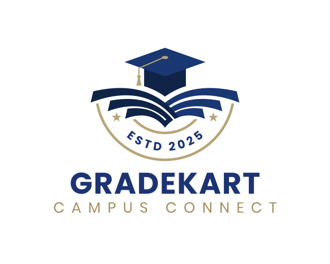

# GradeKart: Your Digital Headquarters for Ambitious Schools & Colleges



GradeKart is a modern academic operating system designed to streamline attendance, academics, fees, hostels, events, counselling, and communication for educational institutions. With purpose-built dashboards and a secure backend, GradeKart aims to remove friction from daily operations and elevate the experience for students, faculty, heads, and owners.

## ✨ Features

-   **Unified Academic Management**: Real-time attendance tracking, timetable visibility, and subject-wise marks with GPA analytics.
-   **Comprehensive Finance & Operations**: Seamless management of fees, transport, hostel, and activities with transparent status indicators.
-   **Engaging Events & Communication**: Smart calendar with reminders, campus announcements, counselling logs, and parent notifications.
-   **Multi-Campus Support**: Built for multi-campus groups and growing schools, mirroring institutional hierarchy for tailored stakeholder views.
-   **Airtable-Native & Future-Ready**: Leverages Airtable for lightning-fast deployment, with a roadmap for deeper analytics and integrations.
-   **Delightful User Experiences**: Intuitive dashboards for students, faculty, and administrators that highlight the next best action instantly.
-   **White-Glove Onboarding**: Dedicated team co-pilots rollout from data mapping to training, ensuring portals launch in days, not months.

## 🚀 Getting Started

Follow these instructions to set up and run GradeKart locally.

### Prerequisites

Ensure you have the following installed:
-   Node.js (LTS version recommended)
-   npm (Node Package Manager)

### Installation

1.  **Clone the repository**:
    ```bash
    git clone https://github.com/kowsik11/GradeKart_Dev.git
    cd GradeKart_Dev
    ```

2.  **Install dependencies**:
    ```bash
    npm install
    ```

### Running the Application

To start the development server:

```bash
npm run dev
```

This will typically start the application on `http://localhost:5173`. Open this URL in your browser to view GradeKart.

## 🛠 Technologies Used

-   **React**: A JavaScript library for building user interfaces.
-   **TypeScript**: A typed superset of JavaScript that compiles to plain JavaScript.
-   **Vite**: A fast build tool that provides a lightning-fast development experience.
-   **React Router DOM**: For declarative routing in React applications.
-   **Tailwind CSS**: A utility-first CSS framework for rapidly building custom designs.
-   **Framer Motion**: A production-ready motion library for React.
-   **Lucide React**: A collection of beautiful open-source icons.
-   **Day.js**: A minimalist JavaScript library for parsing, validating, manipulating, and displaying dates and times.
-   **Airtable**: Used as a secure backend for data management.

## 📂 Project Structure

The project follows a feature-sliced design, organizing code by feature rather than type.

```
.
├── public/                 # Static assets
├── src/
│   ├── api/                # API client integrations (e.g., Airtable)
│   ├── app/                # Core application setup (App.tsx, AppProviders, AppRouter)
│   ├── components/ui/      # Reusable UI components
│   ├── config/             # Environment configurations
│   ├── features/           # Feature-specific modules (auth, landing, schools, student, teacher, etc.)
│   │   ├── auth/
│   │   ├── landing/
│   │   └── schools/
│   ├── lib/                # Utility functions
│   ├── routes/             # Page-level components for different roles
│   └── styles/             # Global styles
├── package.json            # Project dependencies and scripts
├── tsconfig.json           # TypeScript configuration
├── vite.config.ts          # Vite build configuration
└── README.md               # Project README
```

## 🤝 Contributing

We welcome contributions! Please feel free to fork the repository, make your changes, and submit a pull request.

## 📧 Contact

For any inquiries or support, please reach out to kowsikperumalla@gmailcom.

---
*Crafted for education groups ready to scale excellence.*
