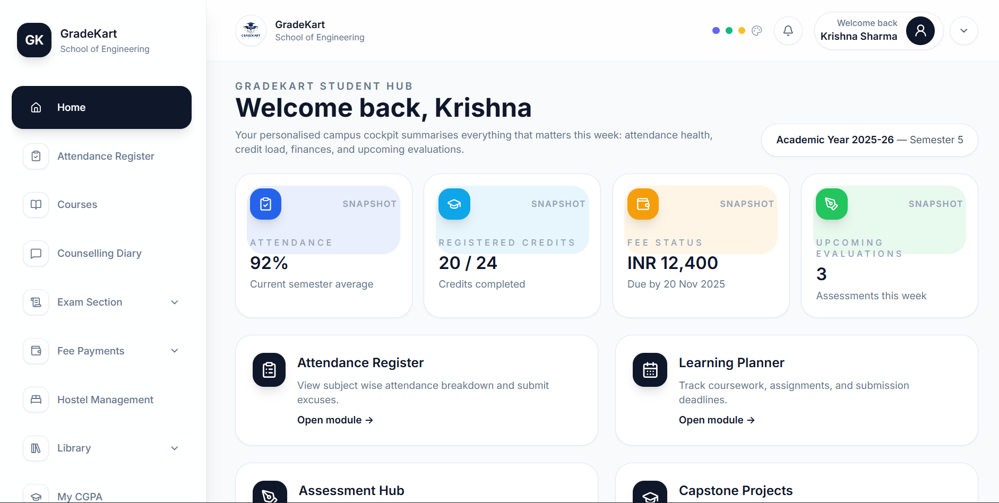
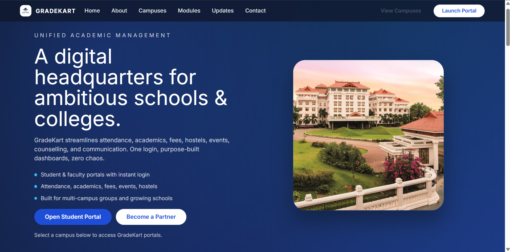

# 🎓 GradeKart: Your Digital Headquarters for Ambitious Schools & Colleges

## 📸 Application Screenshots

Here are some glimpses of GradeKart in action:




GradeKart is a cutting-edge academic operating system meticulously designed to streamline every facet of educational management. From attendance and academics to fees, hostels, events, counselling, and communication, GradeKart provides a unified, intuitive platform. With purpose-built dashboards and a robust, secure backend, GradeKart eliminates operational friction, fostering an elevated experience for students, faculty, heads, and owners alike.

## ✨ Key Features

-   **Unified Academic Management**: 📊 Real-time attendance tracking, crystal-clear timetable visibility, and detailed subject-wise marks with insightful GPA analytics.
-   **Comprehensive Finance & Operations**: 💰 Seamless management of fees, transport, hostel, and extracurricular activities, all within a single pane with transparent status indicators.
-   **Engaging Events & Communication**: 📣 A smart calendar with timely reminders, crucial campus announcements, detailed counselling logs, and instant parent notifications.
-   **Multi-Campus Support**: 🏫 Expertly built for multi-campus groups and rapidly growing schools, GradeKart intelligently mirrors your institutional hierarchy, providing tailored, relevant views for every stakeholder.
-   **Airtable-Native & Future-Ready**: 🚀 We securely leverage Airtable for lightning-fast deployment, while continuously charting a roadmap for deeper analytics and advanced integrations.
-   **Delightful User Experiences**: 💖 Intuitive and beautifully designed dashboards empower students, faculty, and administrators by surfacing the next best action instantly.
-   **White-Glove Onboarding**: 🤝 Our dedicated team co-pilots your entire rollout—from meticulous data mapping to comprehensive training—ensuring your portals launch in days, not months.

## 🚀 Getting Started

Embark on your GradeKart journey by following these simple steps to set up and run the application locally.

### Prerequisites

Before you begin, ensure you have the following essential tools installed on your system:
-   [Node.js](https://nodejs.org/) (LTS version recommended for optimal compatibility)
-   [npm](https://www.npmjs.com/) (Node Package Manager, typically bundled with Node.js)

### Installation

1.  **Clone the repository**:
    Begin by cloning the GradeKart repository to your local machine:
    ```bash
    git clone https://github.com/kowsik11/GradeKart_Dev.git
    cd GradeKart_Dev
    ```

2.  **Install dependencies**:
    Navigate into the cloned directory and install all required project dependencies:
    ```bash
    npm install
    ```

### Running the Application

To launch the GradeKart development server:

```bash
npm run dev
```

Upon successful execution, the application will typically be accessible at `http://localhost:5173`. Open this URL in your preferred web browser to experience GradeKart.

## 🛠 Technologies Under the Hood

GradeKart is built with a robust and modern technology stack to ensure performance, scalability, and a delightful developer experience:

-   **React**: A powerful JavaScript library for crafting dynamic and interactive user interfaces.
-   **TypeScript**: A strongly typed superset of JavaScript, enhancing code quality and maintainability.
-   **Vite**: A next-generation frontend tooling that provides an incredibly fast development environment.
-   **React Router DOM**: The standard library for declarative routing in React applications.
-   **Tailwind CSS**: A highly customizable, utility-first CSS framework for rapid UI development.
-   **Framer Motion**: A production-ready motion library for creating fluid and engaging animations in React.
-   **Lucide React**: A comprehensive collection of beautiful, open-source icons for a polished UI.
-   **Day.js**: A lightweight and efficient JavaScript library for parsing, validating, manipulating, and displaying dates and times.
-   **Airtable**: Utilized as a secure and flexible backend for efficient data management.

## 📂 Project Structure

GradeKart adheres to a clear and scalable feature-sliced design, organizing code logically by feature rather than by type, promoting modularity and ease of maintenance.

```
.
├── public/                 # 🖼️ Static assets and public files
├── src/
│   ├── api/                # 🌐 API client integrations (e.g., Airtable)
│   ├── app/                # ⚙️ Core application setup (App.tsx, AppProviders, AppRouter)
│   ├── components/ui/      # 🎨 Reusable and atomic UI components
│   ├── config/             # 🔧 Environment configurations and constants
│   ├── features/           # 🚀 Feature-specific modules (auth, landing, schools, student, teacher, etc.)
│   │   ├── auth/           # Authentication related logic and UI
│   │   ├── landing/        # Landing page specific components
│   │   └── schools/        # School management features
│   ├── lib/                # 📚 General utility functions and helpers
│   ├── routes/             # 🗺️ Page-level components and route definitions for different user roles
│   └── styles/             # 💅 Global styles and Tailwind CSS configurations
├── package.json            # 📦 Project dependencies and npm scripts
├── tsconfig.json           # 📝 TypeScript compiler configuration
├── vite.config.ts          # ⚡ Vite build and development server configuration
└── README.md               # 📄 This comprehensive project documentation
```

## 🤝 Contributing

We warmly welcome contributions from the community! If you're interested in improving GradeKart, please feel free to fork the repository, implement your enhancements, and submit a pull request.

## 📧 Contact

For any inquiries, support, or partnership opportunities, please don't hesitate to reach out to us at kowsikperumalla@gmail.com.

---
✨ *Crafted with passion for education groups ready to scale excellence.* ✨
